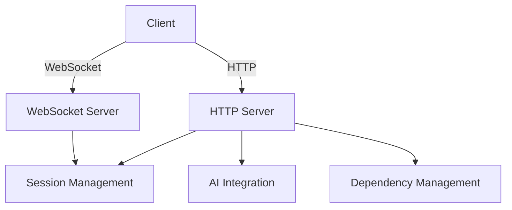
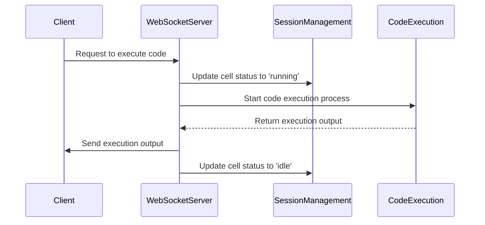
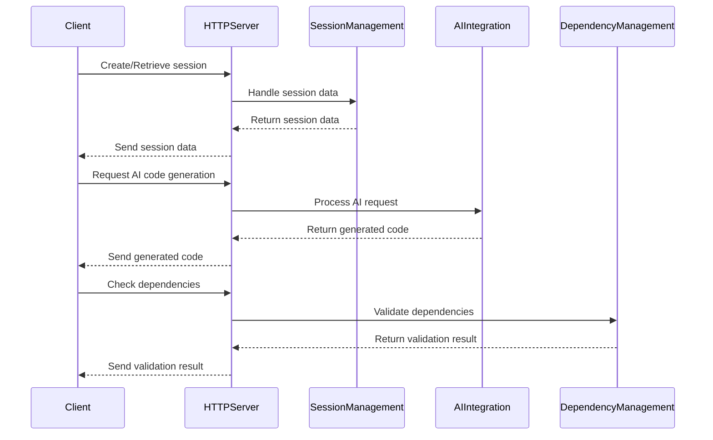
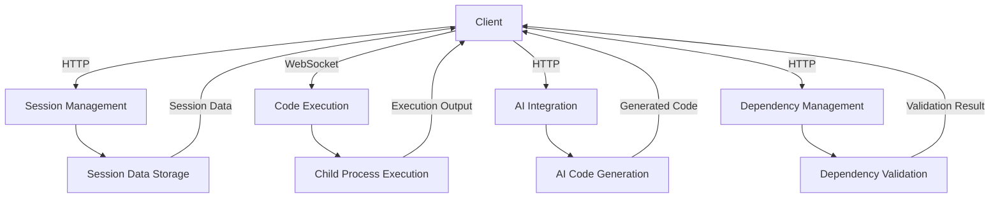
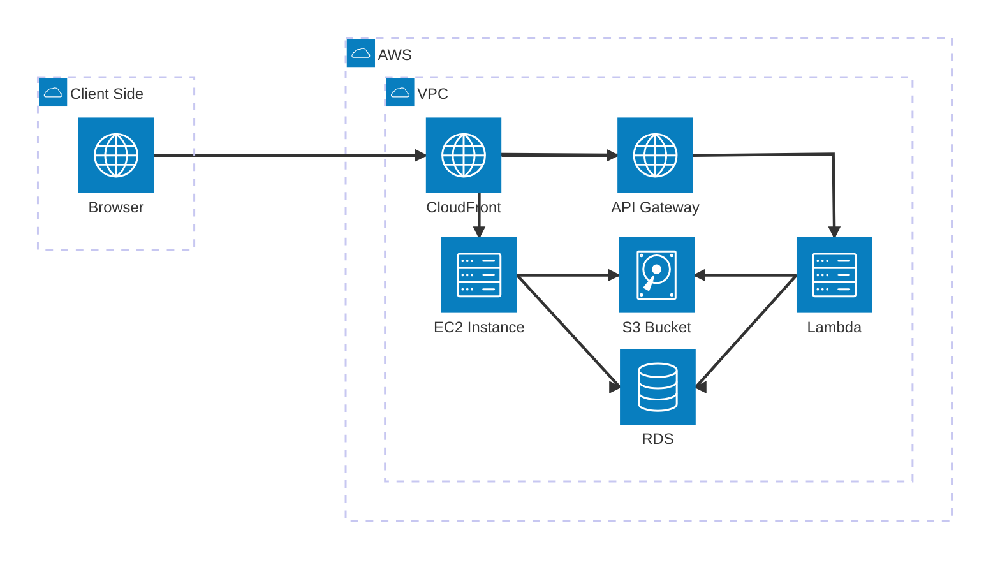

<!-- srcbook:{"language":"typescript","tsconfig.json":{"compilerOptions":{"module":"nodenext","moduleResolution":"nodenext","target":"es2022","resolveJsonModule":true,"noEmit":true,"allowImportingTsExtensions":true},"include":["src/**/*"],"exclude":["node_modules"]}} -->

# Diagramming Srcbook's Architecture

###### package.json

```json
{
  "type": "module",
  "dependencies": {
    "tsx": "latest",
    "typescript": "latest",
    "@types/node": "latest"
  }
}
```

This Srcbook demonstrates [Mermaid diagrams](https://mermaid.js.org/intro/getting-started.html) by using them to showcase Srcbook's high-level architecture.

### Core Components



### WebSockets Data Flow

Manages real-time communication for
- updating cell statuses
- broadcasting messages
- handling execution outputs.



### Http Communication

Handles various RESTful API endpoints for session management, AI generation, and configuration.



### Data Flow

##### Client Interaction:
- Uses WebSocket for real-time updates.
- Uses HTTP for session management, AI requests, and configuration.

##### Session Management:
- HTTP requests to create/retrieve sessions.
- Manages session data on the server.

##### Code Execution:
- Client requests code execution.
- Server runs code and updates status via WebSocket.

##### AI Code Generation:
- Client requests AI-generated code.
- Server processes and returns generated code.

##### Dependency Management:
- Server checks and installs missing dependencies.
- Updates client on dependency status.



## Architecture diagrams (bonus)

There is a large set of icons for describing services available in the [architecture diagrams documentation](https://mermaid.js.org/syntax/architecture.html).

Here is one example:

