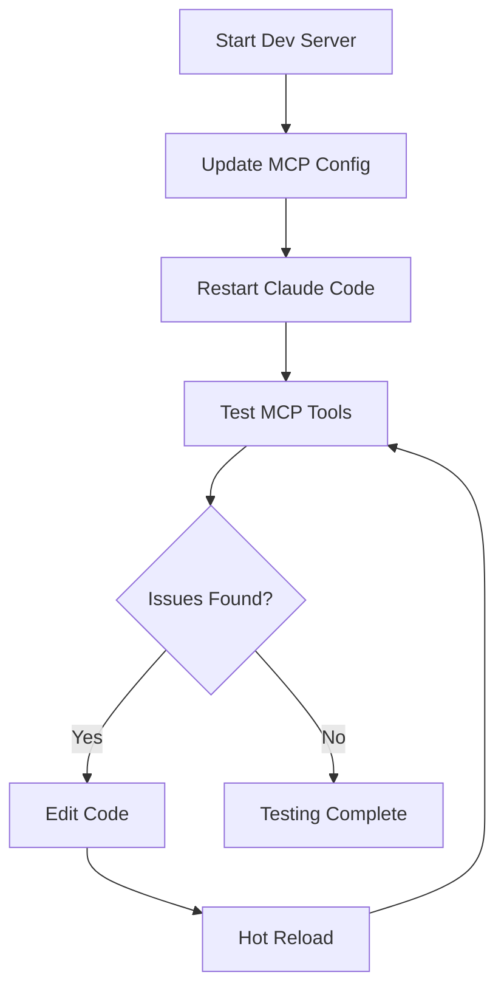

# Peragus MCP Server Testing Specification

## Executive Summary

This specification outlines the comprehensive testing strategy for validating the Peragus MCP server functionality through development server deployment and Claude Code integration. The approach ensures systematic validation of MCP tools, resources, and transport mechanisms while maintaining an iterative development workflow for rapid issue resolution.

## Testing Architecture Overview

### System Components

1. **Peragus Application** - Main TypeScript notebook platform
2. **MCP Server** - Model Context Protocol server exposing notebook operations
3. **Development Server** - Local development environment with hot reload
4. **Claude Code** - MCP client for testing tool invocations
5. **Configuration Bridge** - mcp_config_claude_code.json for connection setup

### Testing Flow



## Phase 1: Development Environment Setup

### 1.1 Install Dependencies
**Objective**: Set up development environment with all required packages

**Commands**:
```bash
# Navigate to worktree directory
cd trees/specs/streaming-http-refactor-smithery.md-1

# Install dependencies
pnpm install
```

**Validation Criteria**:
- ✅ All dependencies installed without errors
- ✅ No version conflicts
- ✅ MCP server package available
- ✅ Development tools ready

### 1.2 Start Development Server
**Objective**: Launch Peragus with MCP server in development mode

**Commands**:
```bash
# Start development server with MCP support
pnpm dev

# Or start MCP server specifically
cd packages/mcp-server && pnpm dev
```

**Environment Variables**:
```bash
export ANTHROPIC_API_KEY="your-key"
export OPENAI_API_KEY="your-key"
export PERAGUS_DISABLE_ANALYTICS=true
export LOG_LEVEL=debug
export MCP_PORT=3001
```

**Validation Criteria**:
- ✅ Development server starts successfully
- ✅ Port 2150 accessible (web UI)
- ✅ Port 3001 accessible (MCP server)
- ✅ Hot reload functioning
- ✅ Logs show MCP server initialization

## Phase 2: MCP Configuration

### 2.1 Configuration Discovery
**Objective**: Determine correct MCP endpoint configuration

**Steps**:
1. Check development server logs for MCP server URL
2. Verify transport type (stdio for development)
3. Confirm authentication requirements
4. Document environment variables needed

**Expected Configuration Format**:
```json
{
  "mcpServers": {
    "peragus-notebooks": {
      "command": "node",
      "args": [
        "/path/to/worktree/packages/mcp-server/dist/cli.mjs"
      ],
      "env": {
        "SRCBOOKS_DIR": "/Users/username/.srcbook",
        "LOG_LEVEL": "debug",
        "ANTHROPIC_API_KEY": "your-key",
        "OPENAI_API_KEY": "your-key"
      },
      "alwaysAllow": [
        "create_notebook",
        "execute_cell",
        "add_cell",
        "update_cell",
        "delete_cell",
        "save_notebook",
        "import_notebook",
        "generate_notebook"
      ]
    }
  }
}
```

### 2.2 Development Mode Configuration
**For multiple worktree testing**:
```json
{
  "mcpServers": {
    "peragus-test-1": {
      "command": "pnpm",
      "args": [
        "--dir",
        "/path/to/trees/specs/streaming-http-refactor-smithery.md-1/packages/mcp-server",
        "run",
        "dev"
      ],
      "env": {
        "SRCBOOKS_DIR": "/Users/username/.srcbook/test-1",
        "LOG_LEVEL": "debug"
      },
      "alwaysAllow": ["*"]
    },
    "peragus-test-2": {
      "command": "pnpm",
      "args": [
        "--dir",
        "/path/to/trees/specs/streaming-http-refactor-smithery.md-2/packages/mcp-server",
        "run",
        "dev"
      ],
      "env": {
        "SRCBOOKS_DIR": "/Users/username/.srcbook/test-2",
        "LOG_LEVEL": "debug"
      },
      "alwaysAllow": ["*"]
    }
  }
}
```

### 2.3 Configuration Update
**Objective**: Update mcp_config_claude_code.json programmatically

**Agent Task**:
1. Read current configuration
2. Add peragus-notebooks server entry
3. Preserve existing server configurations
4. Validate JSON syntax
5. Write updated configuration

## Phase 3: Connection Validation

### 3.1 Initial Connection Test
**Objective**: Verify MCP server discovery and connection

**Test Sequence**:
1. Human: Restart Claude Code
2. Agent: Check for `peragus-notebooks` in available MCP servers
3. Agent: List available tools from server
4. Agent: List available resources from server

**Expected Tools**:
- create_notebook
- execute_cell
- add_cell
- update_cell
- delete_cell
- save_notebook
- import_notebook
- generate_notebook

**Expected Resources**:
- notebook://list
- notebook://read/{id}
- notebook://export/{id}
- notebook://examples

### 3.2 Tool Schema Validation
**Objective**: Verify tool parameter schemas match implementation

**Test Cases**:
```typescript
// Test each tool's parameter validation
await testToolSchema('create_notebook', {
  title: 'Test Notebook',
  language: 'typescript'
});

await testToolSchema('execute_cell', {
  notebookId: 'invalid-id',
  cellId: 'cell-1'
});
```

## Phase 4: Functional Testing

### 4.1 Notebook Creation Test
**Objective**: Create and verify notebook through MCP

**Test Steps**:
1. Call `create_notebook` with title and language
2. Verify returned notebookId
3. Use `notebook://read/{id}` to confirm creation
4. Check file system for notebook file

**Success Criteria**:
- ✅ Notebook created with unique ID
- ✅ Title and language set correctly
- ✅ File exists in container volume
- ✅ Initial cells created properly

### 4.2 Code Execution Test
**Objective**: Execute TypeScript code through MCP

**Test Steps**:
1. Create notebook with `create_notebook`
2. Add code cell with `add_cell`
3. Execute cell with `execute_cell`
4. Verify execution output

**Test Code**:
```typescript
// Test cell content
const greeting = "Hello from MCP!";
console.log(greeting);
return { greeting };
```

**Success Criteria**:
- ✅ Cell execution completes
- ✅ Console output captured
- ✅ Return value accessible
- ✅ No execution errors

### 4.3 Cell Management Test
**Objective**: Test CRUD operations on notebook cells

**Test Matrix**:
| Operation | Test Case | Expected Result |
|-----------|-----------|-----------------|
| Add | Add markdown cell | Cell ID returned |
| Update | Change cell content | Content updated |
| Delete | Remove cell | Cell removed |
| Add | Insert at position | Order preserved |

### 4.4 Resource Access Test
**Objective**: Validate resource endpoints

**Test Cases**:
1. `notebook://list` - Returns all notebooks
2. `notebook://read/{id}` - Returns specific notebook
3. `notebook://export/{id}` - Exports notebook format
4. `notebook://examples` - Lists example notebooks

## Phase 5: Error Handling

### 5.1 Invalid Input Testing
**Objective**: Verify graceful error handling

**Test Cases**:
```typescript
// Test invalid notebook ID
await callTool('execute_cell', {
  notebookId: 'non-existent',
  cellId: 'cell-1'
});
// Expected: NotebookNotFoundError

// Test missing required parameters
await callTool('create_notebook', {
  // Missing title
  language: 'typescript'
});
// Expected: ValidationError
```

### 5.2 Edge Case Testing
**Objective**: Test boundary conditions

**Test Cases**:
- Empty notebook title
- Very long cell content
- Special characters in content
- Concurrent cell executions
- Rapid create/delete cycles

## Phase 6: Performance Testing

### 6.1 Load Testing
**Objective**: Verify server handles multiple operations

**Test Scenarios**:
1. Create 10 notebooks sequentially
2. Execute 20 cells across notebooks
3. Concurrent tool invocations
4. Large code cell execution

**Metrics to Track**:
- Response time per operation
- Memory usage in container
- CPU utilization
- Error rate under load

### 6.2 Stability Testing
**Objective**: Ensure long-running stability

**Test Duration**: 30 minutes continuous operation

**Test Pattern**:
1. Create notebook
2. Add 5 cells
3. Execute all cells
4. Update 2 cells
5. Delete 1 cell
6. Save notebook
7. Repeat cycle

## Phase 7: Integration Testing

### 7.1 AI Workflow Test
**Objective**: Validate end-to-end AI assistant workflow

**Test Scenario**:
"Create a TypeScript notebook that calculates Fibonacci numbers, add explanatory markdown, execute the code, and export the result"

**Expected Flow**:
1. Agent creates notebook
2. Agent adds markdown explanation
3. Agent adds code cell with Fibonacci function
4. Agent executes code
5. Agent verifies output
6. Agent exports notebook

### 7.2 Complex Operations Test
**Objective**: Test advanced MCP capabilities

**Test Cases**:
- Import existing notebook
- Generate notebook with AI
- Multi-cell dependencies
- Error recovery scenarios

## Issue Resolution Workflow

### Standard Debug Process

When issues are encountered:

1. **Identify Issue**
   - Capture error message
   - Note failing tool/resource
   - Check development server logs

2. **Diagnose Root Cause**
   ```bash
   # Check MCP server logs in terminal
   # Look for error stack traces
   
   # Enable verbose logging
   export LOG_LEVEL=verbose
   
   # Check file permissions
   ls -la ~/.srcbook
   ```

3. **Code Modification**
   - Edit relevant source files
   - Update error handling
   - Add debug logging
   - Changes auto-reload with hot reload

4. **Test Fix Immediately**
   - No rebuild needed (hot reload)
   - Claude Code may need restart for MCP changes
   - Test the specific failing operation

5. **Iterate Quickly**
   - Make incremental changes
   - Test after each change
   - Use console.log for quick debugging

## Success Criteria

### Functional Requirements
- ✅ All MCP tools callable from Claude Code
- ✅ All resources accessible via MCP
- ✅ Notebook operations persist to disk
- ✅ Code execution produces expected output
- ✅ Error handling provides useful feedback

### Performance Requirements
- ✅ Tool invocation < 500ms average
- ✅ Code execution < 2s for simple cells
- ✅ Resource listing < 200ms
- ✅ No memory leaks over 30min operation

### Reliability Requirements
- ✅ Container remains stable
- ✅ No data loss on restart
- ✅ Graceful error recovery
- ✅ Concurrent operation support

## Monitoring and Logging

### Log Aggregation
```bash
# Development server logs are already in terminal
# Filter for MCP-specific logs
pnpm dev 2>&1 | grep -E "(MCP|mcp|notebook)"

# Or use separate terminals for each service
# Terminal 1: pnpm dev
# Terminal 2: cd packages/mcp-server && pnpm dev
```

### Health Checks
```bash
# For stdio-based MCP server, check if process is running
pgrep -f "mcp-server"

# Check if development server is responding
curl http://localhost:2150/health

# Monitor file watchers
lsof | grep -E "(fsevents|inotify)"
```

### Performance Monitoring
- Track tool invocation times
- Monitor memory usage trends
- Log error frequencies
- Measure response times

## Test Automation

### Automated Test Suite

Create test script for continuous validation:

```typescript
// test-mcp-integration.ts
import { MCPClient } from '@modelcontextprotocol/sdk';

async function runIntegrationTests() {
  const client = new MCPClient({
    url: 'http://localhost:3001/mcp'
  });
  
  // Test suite implementation
  await testNotebookCreation(client);
  await testCodeExecution(client);
  await testCellManagement(client);
  await testResourceAccess(client);
  await testErrorHandling(client);
}
```

## Development Server Advantages

### Rapid Iteration Benefits

1. **Hot Reload** - Code changes reflect immediately
2. **Direct Debugging** - Use debugger and console.log
3. **No Build Step** - Skip Docker build times
4. **Easy Rollback** - Git checkout to revert changes
5. **Multiple Instances** - Run different worktrees simultaneously

### Workflow Comparison

| Aspect | Docker Workflow | Dev Server Workflow |
|--------|----------------|-------------------|
| Startup Time | 2-3 minutes | 10-15 seconds |
| Code Changes | Rebuild required | Hot reload |
| Debugging | Container logs only | Full debugger access |
| Resource Usage | Higher | Lower |
| Isolation | Complete | Shared with host |

## Conclusion

This testing specification provides a comprehensive framework for validating Peragus MCP server functionality through development server testing. The hot-reload workflow ensures rapid iteration while maintaining thorough validation coverage.

The success of this testing process will validate:
1. MCP server implementation correctness
2. Development workflow efficiency
3. Claude Code integration compatibility
4. Feature completeness for production

Following this specification will ensure a robust, well-tested MCP server implementation with minimal development friction.