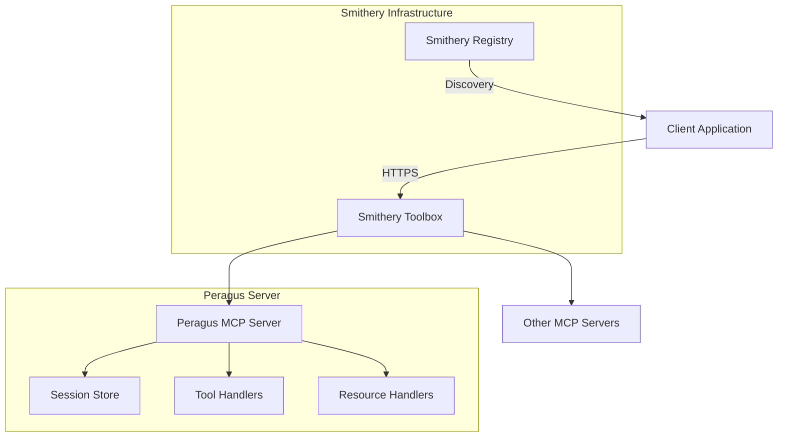

# Smithery SDK Migration Specification

## Migration from Model Context Protocol SDK to Smithery SDK

### Executive Summary

This specification outlines the migration strategy for transitioning Peragus from using the Model Context Protocol (MCP) SDK directly to leveraging the Smithery SDK. The Smithery SDK provides a higher-level abstraction over MCP, offering built-in HTTP transport, session management, configuration validation, and AI provider integrations while maintaining full MCP compatibility.

### Current Architecture Overview

#### MCP Server (`packages/mcp-server`)
- Custom implementation using `StreamableHTTPServerTransport`
- Manual session management with UUID generation
- Express.js integration for HTTP endpoints
- Separate server instances per session

#### MCP Client (`packages/mcp-client`)
- Enhanced client extending base `MCPClientManager`
- Transport adapter pattern for flexibility
- Health monitoring and metrics collection
- Feature-flagged Smithery integration

#### API Integration (`packages/api/mcp`)
- Enterprise-grade service layer with circuit breakers
- Tool approval workflows
- Comprehensive REST API endpoints
- Connection pooling and auto-reconnection

### Smithery SDK Capabilities

Based on analysis of `smithery-sdk/typescript/sdk/` and Smithery's documentation:

The Smithery SDK provides:
1. **Two Server Modes** (`smithery-sdk/typescript/sdk/src/server/`):
   - `createStatelessServer`: New server instance per request (stateless.ts)
   - `createStatefulServer`: Session-based with LRU cache (stateful.ts)

2. **Built-in Features**:
   - Configuration validation with Zod schemas (`shared/config.ts`)
   - Session management with configurable stores (`server/session.ts`)
   - Express.js app creation and routing
   - AI provider integrations (Anthropic, OpenAI) in `client/integrations/`

3. **Transport Simplification** (`client/transport.ts`):
   - Pre-configured `StreamableHTTPClientTransport`
   - Automatic session ID handling
   - Config parsing from URLs, headers, and query params

4. **Registry Integration** (`smithery-sdk/openapi/registry.yaml`):
   - Discover MCP servers via the Smithery Registry
   - Search with filters like `owner:`, `is:verified`, `is:deployed`
   - Bearer token authentication for API access
   - Server metadata including tools, connections, and security status

5. **Toolbox Server Priority**:
   - Smithery recommends using their Toolbox server as the primary deployment target
   - Provides unified gateway for multiple MCP servers
   - Handles authentication, rate limiting, and monitoring
   - Supports both HTTP and stdio connection types

### Toolbox Server Deployment Strategy

According to Smithery's documentation, the recommended deployment approach is:

1. **Deploy to Smithery Toolbox**:
   - Primary deployment target for MCP servers
   - Provides automatic HTTPS endpoints
   - Handles authentication via API keys
   - Built-in monitoring and analytics
   - Automatic registry listing

2. **Configuration via Registry**:
   ```typescript
   // Using Smithery Registry to discover servers
   import { SmitheryRegistry } from "@smithery/registry";
   
   const registry = new SmitheryRegistry({
     bearerAuth: process.env.SMITHERY_BEARER_AUTH
   });
   
   // Find Peragus in the registry
   const servers = await registry.servers.list({
     q: "owner:peragus-dev is:deployed notebook"
   });
   ```

3. **Client Connection via Toolbox**:
   ```typescript
   // Connect through Smithery's unified gateway
   import { createTransport } from '@smithery/sdk/client';
   
   const transport = createTransport('https://toolbox.smithery.ai/peragus-dev/notebook', {
     apiKey: process.env.SMITHERY_API_KEY,
     config: { srcbooksDir: '/notebooks' }
   });
   ```

### Migration Strategy

#### Phase 1: Server Migration

**1.1 Replace Custom Server Implementation**
```typescript
// Current (packages/mcp-server/src/server.mts)
export async function startMCPServer(config: MCPServerConfig): Promise<express.Application> {
  const app = express();
  // ... custom implementation
}

// Migrated
import { createStatefulServer } from '@smithery/sdk/server';

export async function startMCPServer(config: MCPServerConfig): Promise<express.Application> {
  const { app } = createStatefulServer(
    ({ sessionId, config }) => {
      const server = createMCPServer();
      // Register tools and resources
      return server;
    },
    {
      schema: MCPServerConfigSchema,
      sessionStore: createLRUStore({ maxSessions: 100 })
    }
  );
  
  return app;
}
```

**1.2 Consolidate Session Management**
- Remove manual session tracking Maps from `server.mts`
- Leverage Smithery's built-in LRU session store from `smithery-sdk/typescript/sdk/src/server/session.ts`
- Maintain session isolation guarantees
- Configure TTL and max sessions:
```typescript
import { createLRUStore } from '@smithery/sdk/server/session';

const sessionStore = createLRUStore({
  maxSessions: 100,  // Maximum concurrent sessions
  ttl: 3600000      // 1 hour session timeout
});
```

**1.3 Configuration Enhancement**
- Define Zod schema for server configuration
- Support base64-encoded configs via `smithery-sdk/typescript/sdk/src/shared/config.ts`
- Enable dot-notation query parameters (e.g., `?server.port=3001&debug=true`)
- Utilize `parseAndValidateConfig()` for automatic validation:
```typescript
import { parseAndValidateConfig } from '@smithery/sdk/shared';

const configResult = parseAndValidateConfig(req, PeragusConfigSchema);
if (!configResult.ok) {
  return res.status(configResult.error.status).json(configResult.error);
}
```

#### Phase 2: Client Migration

**2.1 Replace Transport Creation**
```typescript
// Current
const transport = new StreamableHTTPClientTransport(url);

// Migrated
import { createTransport } from '@smithery/sdk/client';
const transport = createTransport(baseUrl, { config: clientConfig });
```

**2.2 Simplify Enhanced Client**
- Remove redundant transport adapter logic
- Utilize Smithery's config transformation
- Maintain backward compatibility through feature flags

**2.3 AI Integration**
```typescript
// Add AI SDK integration
import { watchTools, listTools } from '@smithery/sdk/integrations/ai-sdk';

// In client initialization
const tools = await listTools(transport);
const unsubscribe = watchTools(transport, (updatedTools) => {
  // Handle tool updates
});
```

#### Phase 3: API Layer Integration

**3.1 Service Layer Updates**
- Maintain circuit breaker patterns
- Adapt to Smithery's transport interface
- Preserve enterprise features (approval workflows, metrics)

**3.2 Route Consolidation**
- Smithery handles base MCP routes (`/mcp`)
- Keep custom routes for Peragus-specific features
- Add middleware for authentication/authorization

### Implementation Plan

#### Step 1: Create Compatibility Layer (Week 1)
- Wrap existing server with Smithery interfaces
- Ensure no breaking changes
- Add comprehensive tests

#### Step 2: Migrate Server (Week 2)
- Replace server implementation
- Update session management
- Validate with existing clients

#### Step 3: Migrate Client (Week 3)
- Update transport creation
- Simplify enhanced client
- Test with migrated server

#### Step 4: Update API Layer (Week 4)
- Adapt service layer
- Update route handlers
- Integration testing

#### Step 5: AI Provider Integration (Week 5)
- Add AI SDK tools
- Test with Claude, GPT-4
- Document usage patterns

### Benefits of Migration

1. **Reduced Complexity**: Remove ~300 lines of custom transport/session code
2. **Enhanced Features**: Automatic config validation, AI integrations
3. **Better Deployment**: Designed for cloud/edge deployment
4. **Maintained Compatibility**: Full MCP protocol support
5. **Improved Developer Experience**: Simpler API, better documentation

### Risk Mitigation

1. **Feature Parity**: Ensure all current features are maintained
2. **Performance Testing**: Validate session management under load
3. **Backward Compatibility**: Keep feature flags during transition
4. **Rollback Plan**: Maintain ability to revert to direct MCP SDK

### Success Criteria

1. All existing tests pass without modification
2. No breaking changes for API consumers
3. Reduced codebase complexity (target: -30% LOC)
4. Improved startup time and memory usage
5. Successful integration with AI providers

### Configuration Examples

**Server Configuration**
```typescript
interface PeragusServerConfig {
  srcbooksDir: string;
  logLevel: 'debug' | 'info' | 'warn' | 'error';
  maxSessions?: number;
  sessionTimeout?: number;
}

const ServerConfigSchema = z.object({
  srcbooksDir: z.string().default('~/.srcbook'),
  logLevel: z.enum(['debug', 'info', 'warn', 'error']).default('info'),
  maxSessions: z.number().optional().default(100),
  sessionTimeout: z.number().optional().default(3600000) // 1 hour
});
```

**Client Connection**
```typescript
// Direct connection
const transport = createTransport('localhost:3001', {
  config: { srcbooksDir: '/custom/path' }
});

// With base64 config
const transport = createTransport('localhost:3001', {
  config: Buffer.from(JSON.stringify(config)).toString('base64')
});
```

### Testing Strategy

1. **Unit Tests**: Test each component in isolation
2. **Integration Tests**: Validate server-client communication
3. **Load Tests**: Verify session management scalability
4. **Compatibility Tests**: Ensure existing clients work
5. **AI Provider Tests**: Validate tool discovery and execution

### Detailed Migration Examples

#### Server Migration Example

**Before (Current Implementation)**
```typescript
// packages/mcp-server/src/server.mts
const transports = new Map<string, StreamableHTTPServerTransport>();
const servers = new Map<string, Server>();

export async function startMCPServer(config: MCPServerConfig): Promise<express.Application> {
  const app = express();
  app.use(express.json());

  app.post('/mcp', async (req, res) => {
    const sessionId = req.headers['mcp-session-id'] as string | undefined;
    
    if (sessionId && transports.has(sessionId)) {
      // Reuse existing transport
    } else if (!sessionId && isInitializeRequest(req.body)) {
      // Create new session
      const newSessionId = randomUUID();
      const transport = new StreamableHTTPServerTransport({
        sessionIdGenerator: () => newSessionId,
        onsessioninitialized: (sessionId) => {
          transports.set(sessionId, transport);
        }
      });
      
      const server = createMCPServer();
      servers.set(newSessionId, server);
      await server.connect(transport);
    }
    
    await transport.handleRequest(req, res, req.body);
  });
  
  return app;
}
```

**After (Smithery SDK)**
```typescript
// packages/mcp-server/src/server.mts
import { createStatefulServer, createLRUStore } from '@smithery/sdk/server';

export async function startMCPServer(config: MCPServerConfig): Promise<express.Application> {
  const { app } = createStatefulServer(
    ({ sessionId, config: sessionConfig }) => {
      // Create server instance for this session
      const server = createMCPServer();
      
      // Register tools with session-specific context
      registerToolHandlers(server, {
        srcbooksDir: sessionConfig.srcbooksDir || config.srcbooksDir
      });
      
      // Register resources
      registerResourceHandlers(server);
      
      return server;
    },
    {
      schema: MCPServerConfigSchema,
      sessionStore: createLRUStore({
        maxSessions: config.maxSessions || 100,
        ttl: config.sessionTimeout || 3600000
      }),
      app: config.app // Allow custom Express app
    }
  );
  
  // Add custom middleware if needed
  app.use('/health', (req, res) => {
    res.json({ status: 'ok', transport: 'smithery-http' });
  });
  
  return app;
}
```

#### Client Migration Example

**Before (Current Implementation)**
```typescript
// packages/mcp-client/src/enhanced-client.mts
export class EnhancedMCPClientManager extends MCPClientManager {
  private transportAdapter: TransportAdapter;
  
  async connect(config: EnhancedMCPClientConfig): Promise<void> {
    const transport = this.transportAdapter.createTransport(config);
    await super.connect({ ...config, transport });
  }
}
```

**After (Smithery SDK)**
```typescript
// packages/mcp-client/src/enhanced-client.mts
import { createTransport } from '@smithery/sdk/client';
import { watchTools } from '@smithery/sdk/integrations/ai-sdk';

export class EnhancedMCPClientManager extends MCPClientManager {
  private toolWatcher?: () => void;
  
  async connect(config: EnhancedMCPClientConfig): Promise<void> {
    // Use Smithery's transport creation
    const transport = createTransport(config.url, {
      config: config.smitheryConfig,
      apiKey: config.smitheryApiKey,
      profile: config.smitheryProfile
    });
    
    await super.connect({ ...config, transport });
    
    // Set up tool watching if AI integration is enabled
    if (config.enableAIIntegration) {
      this.toolWatcher = watchTools(transport, (tools) => {
        this.emit('tools-updated', tools);
      });
    }
  }
  
  async disconnect(): Promise<void> {
    this.toolWatcher?.();
    await super.disconnect();
  }
}
```

### Enterprise Feature Preservation

The migration must preserve all enterprise features currently in the API layer:

1. **Circuit Breaker Pattern**
   - Maintain failure counting and circuit states
   - Adapt to work with Smithery transports
   - Keep configurable thresholds

2. **Tool Approval Workflow**
   - Preserve 5-minute expiration
   - Maintain approval tracking
   - Support batch approvals

3. **Health Monitoring**
   - Keep 30-second health checks
   - Maintain response time metrics
   - Support custom health endpoints

4. **Batch Operations**
   - Preserve transaction semantics
   - Maintain error aggregation
   - Support partial success handling

### Smithery SDK Integration Benefits

Based on the SDK analysis at `smithery-sdk/typescript/sdk/`:

1. **Unified Configuration Management** (`shared/config.ts`):
   - `createSmitheryUrl()`: Automatic URL generation with config encoding
   - `parseAndValidateConfig()`: Unified config parsing from multiple sources
   - Support for base64 configs, dot-notation params, and JSON schemas

2. **AI Provider Integrations** (`client/integrations/`):
   - `OpenAIChatAdapter`: Direct OpenAI chat completion support
   - `AnthropicAdapter`: Claude integration with tool support
   - `watchTools()`: Real-time tool updates via AI SDK
   - Automatic tool description truncation (1024 chars)

3. **Registry Integration** (`smithery-sdk/openapi/registry.yaml`):
   - Discover servers: `GET /servers` with semantic search
   - Get server details: `GET /servers/{qualifiedName}`
   - Connection info including HTTP/stdio endpoints
   - Security scanning status and tool metadata

4. **Session Management** (`server/session.ts`):
   - LRU cache with configurable size and TTL
   - Automatic session cleanup on disconnect
   - Session isolation for multi-tenant deployments

### Deployment Architecture



### Implementation Roadmap

1. **Week 1-2**: Foundation
   - Set up Smithery SDK dependencies
   - Create compatibility layer
   - Implement basic server with `createStatefulServer()`

2. **Week 3-4**: Migration
   - Port existing tools and resources
   - Migrate client to use `createTransport()`
   - Update API layer to work with new transport

3. **Week 5-6**: Enhancement
   - Add Registry integration
   - Implement AI provider adapters
   - Deploy to Smithery Toolbox

4. **Week 7-8**: Production
   - Performance testing
   - Documentation updates
   - Production deployment

### Conclusion

The migration to Smithery SDK represents a significant simplification of our MCP implementation while maintaining all critical features. By leveraging Smithery's built-in session management, configuration validation, and AI integrations, we can reduce code complexity and improve maintainability. The phased approach ensures minimal disruption while allowing for thorough testing at each stage.

Key advantages:
- **Reduced Complexity**: ~300 lines of custom transport code replaced by SDK
- **Enhanced Features**: Registry discovery, AI integrations, Toolbox deployment
- **Better Operations**: Built-in monitoring, authentication, and rate limiting
- **Future-Proof**: Aligned with Smithery's roadmap and ecosystem